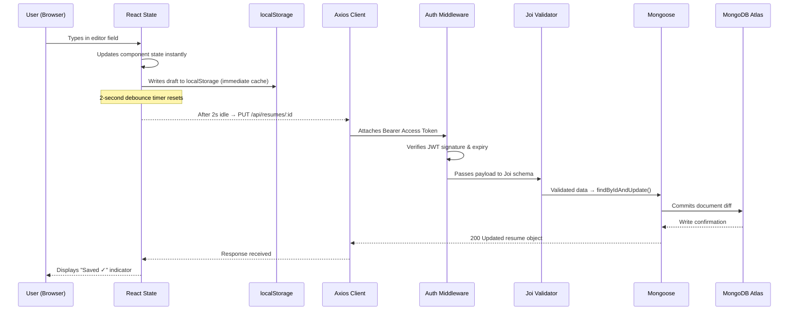
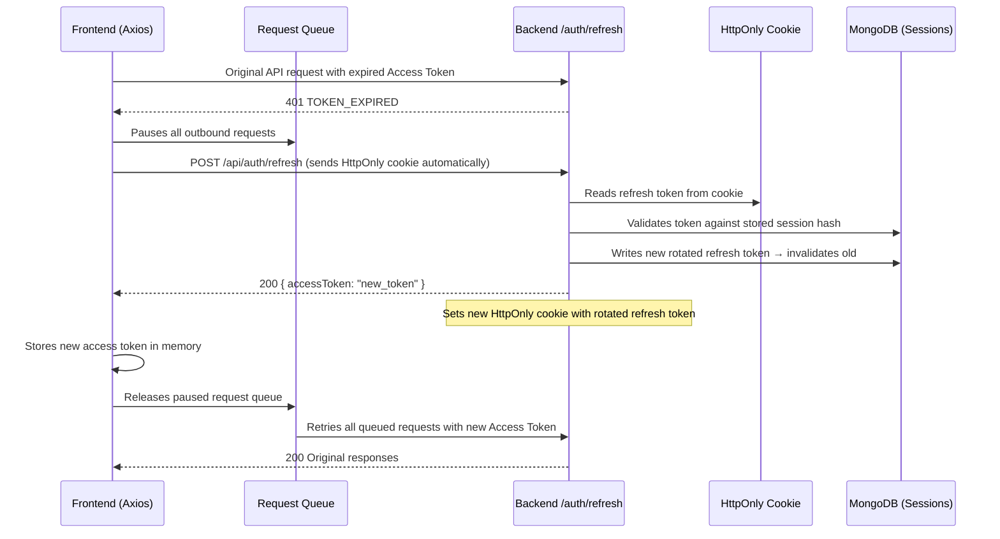
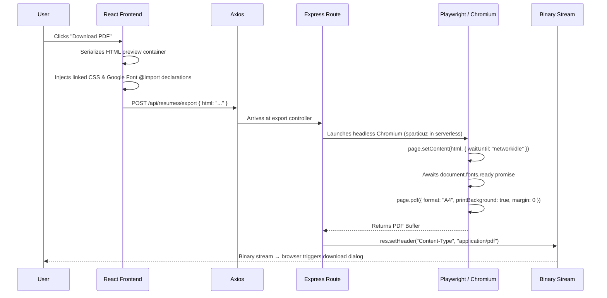

<div align="center">

# ✦ ResumeCraft

### A precision-engineered, full-stack, ATS-friendly resume builder designed for technical professionals.

[](https://react.dev/)
[](https://vitejs.dev/)
[](https://nodejs.org/)
[](https://www.mongodb.com/atlas)
[](https://tailwindcss.com/)
[](https://playwright.dev/)
[](https://jwt.io/)
[](https://vercel.com/)

<br/>

ResumeCraft is a decoupled monorepo full-stack application delivering a real-time split-screen resume editor, Playwright-powered pixel-perfect PDF exports, a dual-token JWT auth system with session rotation and reuse detection, and a decoupled template engine — architected to produce resumes that clear ATS parsing algorithms with 100% fidelity.


*Live split-screen editor — form controls with instant preview rendering*

</div>

---

## 📋 Table of Contents

- [Core Features](#-core-features)
- [Template System Architecture](#-template-system-architecture)
- [Tech Stack](#-tech-stack)
- [System Architecture & Data Flows](#-system-architecture--data-flows)
- [Directory Structure](#-directory-structure)
- [API Reference](#-api-reference)
- [Local Setup](#-local-setup)
- [Environment Variables](#-environment-variables)
- [Security Implementation](#-security-implementation)
- [Testing, Deployment & Roadmap](#-testing-deployment--roadmap)

---

## ✨ Core Features

### 🖥️ Real-Time Split-Screen Editor

A dual-pane editing interface with form controls — Personal Info, Experience, Education, Skills — on the left and an instant-rendering live preview on the right. Layout dimension sliders let users dynamically tune font sizes, margins, and section gaps without breaking the print canvas geometry.


*Form pane and live preview rendering in lockstep*

### ☁️ Auto-Save to Cloud (Debounced)

Changes sync to MongoDB automatically with a **2-second debounce timer**. The flow:
1. User edits a field → React state updates instantly
2. `localStorage` cache is updated immediately (zero-latency perceived save)
3. 2 seconds after typing stops → `PUT /api/resumes/:id` is dispatched to the backend
4. MongoDB commits the diff → frontend displays a success confirmation

This pattern eliminates save-button fatigue while preventing request storms on every keystroke.

### 🔐 Dual-Token JWT Authentication

A production-grade session architecture with two distinct token lifetimes:

| Token | Lifetime | Storage | Purpose |
|---|---|---|---|
| **Access Token** | 15 minutes | Memory / `localStorage` | Authorizes API requests |
| **Refresh Token** | 7 days | `HttpOnly` Cookie | Issues new access tokens silently |

- **Silent Refresh:** Axios interceptors catch `401 TOKEN_EXPIRED` responses, pause the in-flight request queue, call `/api/auth/refresh`, and replay all queued requests with the new access token — invisibly to the user.
- **Session Rotation:** Every refresh cycle issues a **new** refresh token, invalidating the previous one.

### 🛡️ Session Rotation & Reuse Detection

If a previously-used (rotated-out) refresh token is submitted to `/api/auth/refresh`, the backend detects a **token reuse attack** and **immediately revokes all active sessions** for the account, forcing a full re-login across every device.

### 📱 Multi-Device Support

Concurrent sessions are supported on up to **5 devices**. When a 6th device logs in, the oldest session is evicted. A password reset via the forgot-password flow **terminates all sessions globally**, ensuring no compromised session persists post-recovery.

### 🖨️ Playwright PDF Export Pipeline

Clicking "Download PDF" triggers a headless Playwright browser that:
1. Captures the live HTML preview container
2. Wraps it with all linked stylesheets and Google Font declarations
3. POSTs the bundle to `/api/resumes/export`
4. Playwright launches, injects the HTML, waits for `networkidle` and font loaders
5. Prints a pixel-perfect vector PDF buffer (A4, zero margins)
6. Streams the binary back to the browser as a download

Serverless environments use `@sparticuz/chromium`; local environments use standard Playwright — with zero code changes required.

### 📂 Version History & Dashboard

A centralized dashboard to view, search, load, and delete saved drafts. `updatedAt` timestamps are humanized — displayed as `"2 hours ago"`, `"Yesterday"`, etc. — for natural readability.


*Resume dashboard — version history with humanized timestamps and search*

### ✅ ATS Guardrails

The HTML output structure is deliberately engineered for ATS parser compatibility: semantic heading order, no floats or complex CSS grid in exported markup, plain-text-extractable content, and font-safe fallback stacks. Resumes pass through ATS algorithms with **100% parsing fidelity**.

---

## 🎨 Template System Architecture

ResumeCraft separates **rendering logic** (immutable) from **visual style** (configurable) into two distinct layers.

```
┌─────────────────────────────────────────────────────────────┐
│                    TEMPLATE SYSTEM                          │
│                                                             │
│  ┌──────────────────────────────────────────────────────┐   │
│  │             CORE ENGINE  (src/core/)                 │   │
│  │           ── Immutable "Laws of Physics" ──          │   │
│  │                                                      │   │
│  │  · A4 canvas: 210mm × 297mm (794×1123px @ 96 DPI)   │   │
│  │  · PDF export parameters & print media config       │   │
│  │  · Global @media print CSS (zero margins override)  │   │
│  │  · Font-loading protection (prevents layout shift)  │   │
│  └──────────────────────────────────────────────────────┘   │
│                           ▲                                 │
│                  hooks into core engine                     │
│                           │                                 │
│  ┌──────────────────────────────────────────────────────┐   │
│  │          TEMPLATE LAYER  (src/templates/)            │   │
│  │              ── Swappable "Skins" ──                 │   │
│  │                                                      │   │
│  │  🗂 ATS Overleaf   High-density, EB Garamond,        │   │
│  │                   LaTeX-style rule dividers          │   │
│  │                   ← Flagship template                │   │
│  │                                                      │   │
│  │  🗂 Modern         Clean grid, Inter/Poppins,        │   │
│  │                   colored accent system              │   │
│  │                                                      │   │
│  │  🗂 Classic        Serif-centered, corporate-ready,  │   │
│  │                   traditional block formatting       │   │
│  └──────────────────────────────────────────────────────┘   │
└─────────────────────────────────────────────────────────────┘
```

> [!NOTE]
> The Core Engine is intentionally **immutable** — templates cannot override A4 dimensions, print margins, or font-load guards. This guarantees that all templates produce pixel-identical PDFs regardless of visual style choices.

---

## ⚙️ Tech Stack

### Frontend

| Category | Library / Tool | Purpose |
|---|---|---|
| **Framework** | React 18 | Component-based UI rendering |
| **Build Tool** | Vite | 10× faster HMR and optimized bundling |
| **Routing** | React Router DOM v6 | Protected routes, guest routes, SPA navigation |
| **Styling** | Tailwind CSS v3.4.4 | Utility-first responsive styling |
| **Animations** | Framer Motion, GSAP | Page transitions, scroll-driven animations |
| **Icons** | Lucide React | Consistent SVG icon system |
| **Utilities** | `clsx`, `tailwind-merge` | Conditional class composition |
| **HTTP Client** | Axios | Request/response interceptors for silent token refresh |

### Backend

| Category | Library / Tool | Purpose |
|---|---|---|
| **Runtime** | Node.js | JavaScript server runtime |
| **Framework** | Express.js | REST API routing and middleware pipeline |
| **Database** | MongoDB Atlas | Cloud-hosted document store |
| **ODM** | Mongoose v8.4.0 | Schema definition, indexing, password-hash hooks |
| **Validation** | Joi | Strict payload schema contracts on all endpoints |
| **Auth** | `jsonwebtoken`, `bcryptjs` | Token generation, password hashing (12 rounds) |
| **Email** | Nodemailer | OTP dispatch for verification and password recovery |
| **PDF Engine** | Playwright v1.59.1 | Headless browser PDF generation |
| **Serverless PDF** | `@sparticuz/chromium` | Chromium binary optimized for serverless environments |
| **Security** | Helmet, `express-rate-limit` | HTTP header hardening, API rate limiting |
| **Cookies** | `cookie-parser` | `HttpOnly` cookie management for refresh tokens |

---

## 🏗️ System Architecture & Data Flows

### 1. Client-Server Edit & Auto-Save Flow



### 2. JWT Silent Refresh Flow



> [!IMPORTANT]
> If a **reused** (already-rotated) refresh token is detected at step `BE->>DB: Validates token`, the backend immediately purges **all** session records for the user and returns `403 TOKEN_REUSE_DETECTED` — forcing a full re-login on every device.

### 3. Playwright PDF Generation Pipeline



---

## 📁 Directory Structure

```text
📁 RESUME-BUILDER/
│
├── 📁 backend/
│   ├── 📁 config/
│   │   └── db.js                   # MongoDB Atlas connection via Mongoose
│   │
│   ├── 📁 controllers/
│   │   ├── authController.js       # Register, login, refresh, logout, OTP flows
│   │   └── resumeController.js     # CRUD + PDF export orchestration
│   │
│   ├── 📁 middleware/
│   │   ├── auth.js                 # JWT verification middleware (protects routes)
│   │   └── errorHandler.js        # Centralized error response formatter
│   │
│   ├── 📁 models/
│   │   ├── User.js                 # Mongoose schema: users, sessions[], bcrypt hooks
│   │   └── Resume.js               # Mongoose schema: title, data{}, timestamps
│   │
│   ├── 📁 routes/
│   │   ├── authRoutes.js           # /api/auth/* route definitions
│   │   └── resumeRoutes.js         # /api/resumes/* route definitions
│   │
│   ├── 📁 services/
│   │   └── emailService.js         # Nodemailer transport — OTP & recovery emails
│   │
│   ├── 📁 utils/
│   │   ├── generateToken.js        # JWT signing helpers (access + refresh)
│   │   └── validators.js           # Shared Joi schema definitions
│   │
│   └── server.js                   # Express app bootstrap, middleware registration
│
└── 📁 frontend/
    └── 📁 src/
        ├── 📁 components/
        │   ├── Navbar.jsx           # Authenticated navigation shell
        │   ├── ResumePreview.jsx    # Live-rendered A4 canvas component
        │   └── InputField.jsx       # Reusable controlled input primitive
        │
        ├── 📁 context/
        │   ├── AuthContext.jsx      # Global auth state, token storage, refresh logic
        │   └── ResumeContext.jsx    # Resume state, debounced auto-save dispatcher
        │
        ├── 📁 core/
        │   ├── canvasConfig.js      # A4 dimensions, DPI constants, PDF params
        │   └── printStyles.css      # @media print overrides (zero-margin reset)
        │
        ├── 📁 pages/
        │   ├── Home.jsx             # Landing page
        │   ├── Dashboard.jsx        # Version history, search, resume management
        │   ├── Editor.jsx           # Split-screen editor with template switcher
        │   └── Login.jsx            # Auth flows (login, register, OTP, recovery)
        │
        ├── 📁 services/
        │   └── api.js               # Axios instance with interceptor configuration
        │
        ├── 📁 templates/
        │   ├── ATSOverleaf.jsx      # Flagship: EB Garamond, LaTeX dividers
        │   ├── Modern.jsx           # Grid layout, Inter/Poppins, color accents
        │   └── Classic.jsx          # Serif-centered, corporate block formatting
        │
        └── App.jsx                  # Route tree (Protected, Guest, Public routes)
```

---

## 🔌 API Reference

### Authentication — `/api/auth`

| Method | Endpoint | Access | Request Body | Response |
|---|---|---|---|---|
| `POST` | `/register` | Public | `{ name, email, password }` | `201` OTP dispatched to email |
| `POST` | `/verify-otp` | Public | `{ email, otp }` | `200` Access token + user profile |
| `POST` | `/login` | Public | `{ email, password }` | `200` Tokens · `403` Unverified account |
| `POST` | `/refresh` | Cookie only | — (HttpOnly cookie auto-sent) | `200` New access token |
| `POST` | `/forgot-password` | Public | `{ email }` | `200` OTP dispatched |
| `POST` | `/reset-password` | Public | `{ email, otp, newPassword }` | `200` Success · All sessions revoked |
| `POST` | `/resend-otp` | Public | `{ email, purpose }` | `200` OTP resent |
| `POST` | `/logout` | 🔒 Protected | — | `200` Cookie cleared · Session evicted |
| `GET` | `/me` | 🔒 Protected | — | `200` Current user profile object |

### Resume CRUD — `/api/resumes`

| Method | Endpoint | Access | Request Body | Response |
|---|---|---|---|---|
| `POST` | `/export` | Public | `{ html: string }` | `200` Binary PDF stream |
| `GET` | `/` | 🔒 Protected | — | `200` Array of all user resumes |
| `GET` | `/:id` | 🔒 Protected | — | `200` Single resume object |
| `POST` | `/` | 🔒 Protected | `{ title, data }` | `201` Created resume object |
| `PUT` | `/:id` | 🔒 Protected | `{ title, data }` | `200` Updated resume object |
| `DELETE` | `/:id` | 🔒 Protected | — | `200` Deletion confirmation |

> [!NOTE]
> All `🔒 Protected` endpoints require a valid `Authorization: Bearer <accessToken>` header. Expired tokens are rejected with `401 TOKEN_EXPIRED`, triggering the silent refresh flow on the client.

---

## 🚀 Local Setup

### Prerequisites

- Node.js ≥ 18
- A [MongoDB Atlas](https://www.mongodb.com/atlas) cluster (free tier works)
- A Gmail account with an [App Password](https://support.google.com/accounts/answer/185833) enabled

### Step 1 — Clone the Repository

```bash
git clone https://github.com/your-username/resumecraft.git
cd resumecraft
```

### Step 2 — Backend Setup

```bash
cd backend
npm install
```

Create `backend/.env` (see [Environment Variables](#-environment-variables) below), then:

```bash
npm run dev     # Starts with Nodemon on port 5000
```

### Step 3 — Frontend Setup

```bash
cd ../frontend
npm install
```

Create `frontend/.env` (see [Environment Variables](#-environment-variables) below), then:

```bash
npm run dev     # Vite dev server → http://localhost:5173
```

### Step 4 — Verify the Stack

Open `http://localhost:5173` in your browser. Register an account, verify via OTP, and open the Editor. The split-screen should load with a live preview. Try downloading a PDF to confirm the Playwright pipeline is running.

---

## 🔑 Environment Variables

### `backend/.env`

```env
# ─── Database ──────────────────────────────────────────────────────
MONGODB_URI=your_mongodb_atlas_connection_string

# ─── JWT Auth ──────────────────────────────────────────────────────
JWT_SECRET=your_long_random_jwt_secret_key
ACCESS_TOKEN_EXPIRE=15m
REFRESH_TOKEN_EXPIRE=7d

# ─── Email (Nodemailer via Gmail) ──────────────────────────────────
EMAIL_SERVICE=gmail
EMAIL_USER=your_email@gmail.com
EMAIL_PASS=your_gmail_app_password      # Use App Password, not account password

# ─── Server ────────────────────────────────────────────────────────
NODE_ENV=development
PORT=5000
CLIENT_URL=http://localhost:5173        # CORS origin whitelist
```

### `frontend/.env`

```env
# ─── API Base URL ──────────────────────────────────────────────────
VITE_API_URL=http://localhost:5000/api
```

> [!WARNING]
> `JWT_SECRET` must be a cryptographically random string of at least 64 characters. Use `openssl rand -hex 64` to generate one. Never commit `.env` files to version control.

---

## 🛡️ Security Implementation

| Threat | Mitigation |
|---|---|
| **XSS** | Input escaping on all user content; `HttpOnly` cookies for refresh tokens (inaccessible to `document.cookie`) |
| **CSRF** | Bearer access tokens bound to `Authorization` header (not auto-sent by browser); strict CORS origin whitelist |
| **Token Theft** | 15-minute access token TTL limits exposure window; refresh tokens rotate on every use |
| **Session Hijacking** | Token reuse detection: replaying a rotated refresh token triggers **full account session purge** |
| **Brute Force** | `express-rate-limit` applied to `/api/auth/*` endpoints |
| **Payload Injection** | Joi schema validation enforces strict type contracts on every inbound request body |
| **Header Attacks** | Helmet middleware sets `X-Content-Type-Options`, `X-Frame-Options`, `Strict-Transport-Security`, and CSP headers |
| **Password Storage** | Bcryptjs with **12 salt rounds** — deliberately slow to resist offline dictionary attacks |

---

## 🧪 Testing, Deployment & Roadmap

### Testing Strategy

| Layer | Tool | Coverage |
|---|---|---|
| **Unit** | Jest | Auth controllers, token utilities, Joi validators |
| **Integration** | Supertest | Full API endpoint contracts with mock MongoDB |
| **E2E** | Playwright | Signup → OTP verification → resume creation → PDF download |

### Deployment

| Service | Role |
|---|---|
| **Vercel** | Frontend static hosting + serverless backend API functions |
| **MongoDB Atlas** | Fully managed cloud database |
| **`@sparticuz/chromium`** | Chromium binary packaged for serverless Playwright PDF generation |

### Scaling Roadmap

- 🔴 **Redis Caching** — Cache frequently-accessed resume documents to reduce MongoDB read load
- 🟡 **Message Queue (BullMQ / RabbitMQ)** — Offload Nodemailer OTP dispatch to an async worker queue, preventing email latency from blocking auth response times
- 🟢 **AWS S3 + Cloudflare CDN** — Store generated PDFs on S3 and serve via Cloudflare edge nodes, eliminating redundant PDF regeneration for unchanged resumes

---

<div align="center">

**Built by [SAMXH](https://github.com/your-username)**

*React · Node.js · MongoDB · Playwright · JWT · Tailwind CSS*

</div>